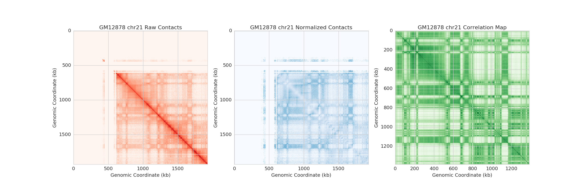

blueberry
=====================================



blueberry implements efficient data structures for the storage, analysis,
and exploration of Hi-C datasets. Currently it supports data types for
the storage of raw Hi-C datasets, performing KR matrix-balancing,
observed/expected normalization, calculation of correlation matrices,
and calculation of the first eigenvector, as well as datatypes for
Fit-Hi-C results.

This page currently serves as an API reference for these data structures.


* [Data Structures](datatypes.md)

Contents:

```eval_rst
.. toctree::
   :maxdepth: 2

   datatypes.md
```

```eval_rst
Indices and tables
==================

* :ref:`genindex`
* :ref:`modindex`
* :ref:`search`
```
